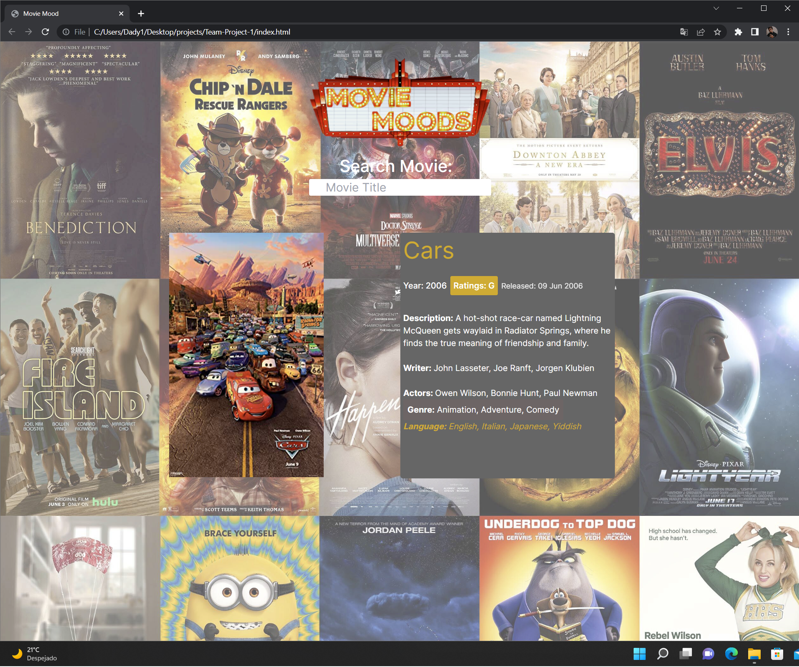
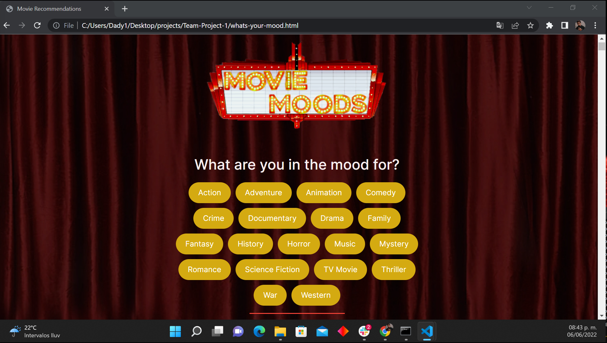
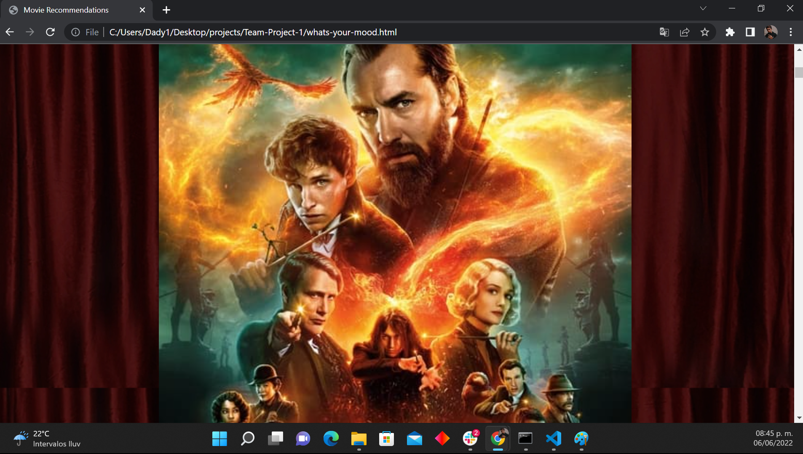

# Movie Moods

## Purpose
This website is designed for all the users who want to know details about a specific movie such as the year of creation, ratings, a description, the writers, the actors, the genre, and also a cool movie poster. We also give you a few options if you don't know what to watch, we give you a variety of genre options you can choose from, and also a great poster will be displayed with a specific random movie that you could probably love.

## Built With
* HTML
* CSS 
* JavaScript
* Tailwind
* TMDB & OMDB API's

## Website
https://israel2800.github.io/Team-Project-1/

## GitHub Repository (Team Project)
https://github.com/GordonOrr/Team-Project-1 

## Screenshots

## Contribution
Made with ❤️ by [Israel Aguilar, Gordon Orr, Dacc Broussard, Jerilyn Wise]

### ©️2022 Movie Mood
